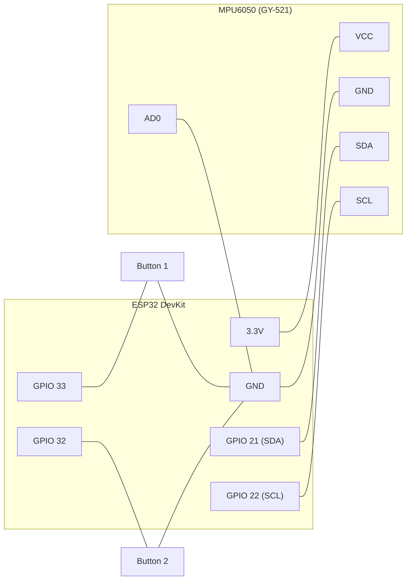

# ESP32 Game Hub 🎮 (MPU6050 + Pushbutton Controlled)

A self-contained, offline arcade **game hub** that runs entirely on an **ESP32**.
The ESP32 hosts its own WiFi hotspot and web server — no internet, router, or
app install needed. A **MPU6050** tilt sensor and **two pushbuttons** are the
controllers; pick a game from the on-screen menu and play right in the browser.

> This repo/project is still named `FruitNinja_ESP32` for historical reasons
> (it started as a single fruit-slicing game), but the firmware now serves a
> full **Game Hub** with seven different games — not Fruit Ninja.

- No router / internet required — the ESP32 *is* the network (WiFi Access Point).
- **Seven built-in games**, each using tilt, buttons, or a device shake as
  its control scheme — see [Games](#games) below.
- MPU6050 is read via the **Adafruit MPU6050** + **Adafruit Unified Sensor**
  libraries (installed automatically by PlatformIO).
- The entire hub (HTML + CSS + JS, canvas-based) is embedded in the firmware
  and served from flash memory — one file, one flash, fully offline.
- Sound effects are synthesized on the fly in the browser (Web Audio API) —
  no audio files needed.
- Per-game **high scores** are saved in the browser (`localStorage`) and
  shown on the hub menu; the two pushbuttons double as physical controls for
  **restart** and **clear all high scores** (see [Button Gestures](#button-gestures)).

---

## How It Works

1. The ESP32 boots, initializes the MPU6050 over I2C, and starts a WiFi
   **Access Point** (`WIFI_AP` mode).
2. It runs a small web server (port 80) with two routes:
   - `GET /` — serves the full game hub page (`index_html.h`).
   - `GET /data` — returns live MPU6050 accelerometer/gyro readings plus the
     two pushbutton states as JSON, e.g.
     `{"ax":0.01,"ay":0.98,"az":0.05,"gx":1.2,"gy":-0.3,"gz":0.1,"btn1":false,"btn2":false}`.
3. Your phone/laptop connects to the ESP32's WiFi network and opens the hub
   page in a browser.
4. The page polls `GET /data` about 50 times per second. That single feed
   drives everything: tilt-based steering, button presses/holds, and — via a
   jerk-detection check on the raw acceleration — device shakes.
5. Pick a game from the hub menu, tap **Launch**, and play. Every game shares
   the same Score/Lives HUD, the same restart gesture, and the same
   high-score store.
6. The Serial Monitor also prints live MPU6050 readings once per second for
   wiring sanity checks.

---

## Games

| Game | Control | What it plays like |
|---|---|---|
| 🚀 **Space War** | Tilt | Vertical shooter — tilt to steer your fighter, guns fire automatically, dodge enemy fire and mines, fly through the blue orb for an overdrive boost. |
| 🌀 **Tilt Maze** | Tilt | Roll a ball through a maze to the glowing goal; red hazards send you back to the start. |
| ⚡ **Reaction Rush** | Buttons | An arrow flashes LEFT or RIGHT — press the matching button before time runs out. Gets faster the longer you survive. |
| 🏎️ **Car Race** | Buttons | Press LEFT/RIGHT to change lanes on a 3-lane road and dodge oncoming traffic. |
| 🕷️ **Spider Web** | Shake | A bug appears on the wall — **shake the device** to make the spider throw a web at it before the ring runs out. |
| 🧑‍🚀 **Jetpack Aviator** | Buttons (hold) | Hold either button to thrust upward, let go to fall — dodge the scrolling barriers, Jetpack-Joyride style. |
| 🧱 **Brick Breaker** | Tilt | Classic Breakout — tilt to slide the paddle, keep the ball alive, and clear every brick. |

Every game shares the same **Score** counter and **3-heart** lives display
top-left, and the same **Menu** button (top-right) to jump back to the hub at
any time. Games marked **Tilt** also show a **Calibrate** button; button-only
and shake-only games hide it since it doesn't apply.

---

## Button Gestures

The two pushbuttons aren't just for Reaction Rush / Car Race / Jetpack — they
also drive two hub-wide gestures, available from any game's instructions or
Game Over screen:

- **Hold BOTH buttons together** → (re)starts the current game. This is the
  main way to play again after Game Over without touching the screen.
- **Hold ONE button alone for 3 seconds** → clears **every** game's saved
  high score (with a confirmation toast, and a live countdown shown at the
  bottom of the screen while holding). This is disabled while a button-driven
  game (Reaction Rush, Car Race, Jetpack Aviator) is actively being played, so
  a fast press during gameplay never wipes your scores by accident.

---

## Hardware Required

| Part | Notes |
|---|---|
| ESP32 development board | Any standard ESP32 dev board (WROOM-32, DevKit V1, etc.) |
| MPU6050 (GY-521 breakout) | 6-axis accelerometer + gyroscope, I2C |
| 2x pushbutton | Momentary, normally-open — restart, clear-scores, and three games' controls |
| USB cable | For programming and power |
| Jumper wires | 4 for the MPU6050 (VCC, GND, SDA, SCL) + 2 for the buttons |

---

## Pin Diagram / Wiring

Two things connect to the ESP32: the **MPU6050** tilt sensor (I2C) and **two
pushbuttons** (plain digital inputs).

### MPU6050 (GY-521)

| MPU6050 / GY-521 Pin | ESP32 Pin | Purpose |
|:---:|:---:|---|
| **VCC** | **3.3V** | Power (do **not** use 5V — most GY-521 boards are 3.3V logic) |
| **GND** | **GND** | Ground |
| **SCL** | **GPIO 22** | I2C Clock |
| **SDA** | **GPIO 21** | I2C Data |
| **AD0** | **GND** (or leave floating) | Sets I2C address to `0x68` |
| INT, XDA, XCL | *Not connected* | Unused in this project |

### Pushbuttons

Each button has two legs. Wire **one leg to the GPIO pin, the other leg to
GND** — no external resistor needed, the sketch enables the ESP32's internal
pull-up on both pins (`pinMode(pin, INPUT_PULLUP)`), so a press pulls the pin
LOW.

| Button | ESP32 Pin | Other leg |
|:---:|:---:|---|
| **Button 1** | **GPIO 33** | GND |
| **Button 2** | **GPIO 32** | GND |

### Full wiring diagram



> Both buttons share the same GND rail as the MPU6050 — any GND pin on the
> ESP32 works, they're all the same net. `INT`, `XDA`, `XCL` on the MPU6050
> are left unconnected and aren't shown above.

> **Tip:** GPIO 21 (SDA) and GPIO 22 (SCL) are the ESP32's default I2C pins,
> so no `Wire.setPins()` remapping is needed — the sketch calls
> `Wire.begin(SDA_PIN, SCL_PIN)` explicitly with these values anyway.

---

## Project Files

| File | Description |
|---|---|
| [FruitNinja_ESP32.ino](FruitNinja_ESP32.ino) | Main sketch: WiFi AP, web server, MPU6050 driver (Adafruit library), pushbutton reading |
| [index_html.h](index_html.h) | The entire game hub (HTML/CSS/JS canvas games) as a `PROGMEM` string, served at `/` — hub menu + all seven games |
| [platformio.ini](platformio.ini) | PlatformIO environment config and library dependencies |

---

## Software Setup / How to Upload the Code

### Option A: PlatformIO (recommended)

This project ships a [platformio.ini](platformio.ini) targeting a generic
`esp32dev` board and pulls in the required libraries automatically:

```ini
lib_deps =
	adafruit/Adafruit MPU6050@^2.2.6
	adafruit/Adafruit Unified Sensor@^1.1.14
```

1. Install [PlatformIO](https://platformio.org/) (standalone or the VS Code
   extension).
2. Open this folder as a PlatformIO project.
3. Wire the MPU6050 and the two pushbuttons as described in the
   [pin diagram](#pin-diagram--wiring).
4. Update `upload_port` / `monitor_port` in `platformio.ini` to match your
   ESP32's serial port if it isn't `/dev/ttyUSB0`.
5. Build and upload (PlatformIO: Upload).

### Option B: Arduino IDE

1. **File → Preferences** → add to "Additional Board Manager URLs":
   `https://raw.githubusercontent.com/espressif/arduino-esp32/gh-pages/package_esp32_index.json`
2. **Tools → Board → Boards Manager** → install **esp32** (by Espressif Systems).
3. **Tools → Manage Libraries** → install **Adafruit MPU6050** and
   **Adafruit Unified Sensor**.
4. Open `FruitNinja_ESP32.ino`. Make sure `index_html.h` is in the **same
   folder** as the `.ino` file (the IDE will show it as a second tab
   automatically).
5. **Tools → Board** → choose your ESP32 board (e.g. "ESP32 Dev Module").
6. **Tools → Port** → select the COM port your ESP32 is connected to.
7. Wire the MPU6050 and the two pushbuttons as described in the
   [pin diagram](#pin-diagram--wiring).
8. Click **Upload**. If the board doesn't enter flashing mode automatically,
   hold the **BOOT** button while the IDE says "Connecting...".

### Connect and Play

1. Open the **Serial Monitor** (115200 baud) to confirm the AP started —
   you should see:
   ```
   AP started. Connect to WiFi "SpaceWar_ESP32" then open http://192.168.4.1
   AP IP address: 192.168.4.1
   ```
2. On your phone or laptop, connect to the WiFi network:
   - **SSID:** `SpaceWar_ESP32`
   - **Password:** `12345678`
3. Open a browser and go to **http://192.168.4.1** — you'll land on the
   **Game Hub** menu.
4. Pick a game, tap **Launch**, and play. For tilt games, hold the ESP32 +
   MPU6050 flat and tap **Calibrate** first.

---

## Gameplay Notes

- **Lives & Score:** Every game uses the same 3-heart lives system and score
  counter, shown top-left. Losing all 3 hearts ends the run.
- **High score:** Each game's best score is saved locally in the browser
  (`localStorage`) and shown both on its hub tile and its instructions/Game
  Over screen.
- **Calibrate button:** For tilt games, zeroes out the current tilt as
  "center" — use it any time the neutral resting angle drifts.
- **Restart:** Hold both pushbuttons together on any Game Over (or
  instructions) screen to play again instantly — see
  [Button Gestures](#button-gestures).
- **Clear all high scores:** Hold either single pushbutton for 3 seconds from
  any non-gameplay screen.

---

## Customization

- **WiFi name/password:** edit `AP_SSID` and `AP_PASSWORD` near the top of
  `FruitNinja_ESP32.ino` (password must be 8+ characters, or set to `""` for
  an open network).
- **I2C pins:** edit `SDA_PIN` / `SCL_PIN` in `FruitNinja_ESP32.ino` if you
  wire the MPU6050 to different GPIOs.
- **Button pins:** edit `BTN1_PIN` / `BTN2_PIN` in `FruitNinja_ESP32.ino` if
  you wire the buttons to different GPIOs.
- **MPU6050 sensitivity/filtering:** edit the `mpu.setAccelerometerRange()`,
  `mpu.setGyroRange()`, `mpu.setFilterBandwidth()`, and
  `mpu.setHighPassFilter()` calls in `setup()`.
- **Tilt feel (all tilt games):** `index_html.h` has one shared tilt config
  block (`SWAP_AXES`, `INVERT_X`, `INVERT_Y`, `SENSITIVITY`, `DAMPING`,
  `SMOOTHING`, `MAX_SPEED`) used by Space War, Tilt Maze, and Brick Breaker —
  tune it once and every tilt game feels consistent.
- **Shake sensitivity (Spider Web):** `SHAKE_THRESHOLD` and
  `SHAKE_DEBOUNCE_MS`, also near the top of the `<script>` section, control
  how hard a shake needs to be and how soon another one can register. Tune by
  testing on real hardware — too low triggers during normal handling, too
  high needs a hard flick.
- **Add/remove a game:** each game is a self-contained block (its own
  `xReset/xStart/xGameOver/xUpdate/xDraw` functions and namespaced state) plus
  one entry in the `GAMES` array and one line in each of `isPlaying()`,
  `backToHub()`, `startActiveGame()`, `update()`, and `draw()`. Follow an
  existing game (e.g. Car Race, the shortest one) as a template.
- **Game look/feel/difficulty:** edit `index_html.h` — it's plain HTML/CSS/JS
  (enemy types, spawn rates, scoring, brick layout, obstacle speed, etc. are
  defined near the top of each game's block).

---

## Troubleshooting

| Problem | Likely Cause |
|---|---|
| Can't see the `SpaceWar_ESP32` WiFi network | ESP32 didn't boot / upload failed — check Serial Monitor for errors |
| Page won't load at `192.168.4.1` | Make sure your device is connected to the ESP32's WiFi, not your home WiFi |
| Serial prints "Failed to find MPU6050 chip!" | Check MPU6050 wiring, especially SDA/SCL and 3.3V power |
| Ship/paddle/marble drifts or doesn't center | Hold the sensor flat and tap **Calibrate** |
| Holding both buttons doesn't restart | Confirm both legs of each button land on the correct GPIO (33/32) and GND; it only restarts from an instructions/Game Over screen, not mid-play |
| Holding one button doesn't clear scores | It's disabled while actively playing a button-driven game (Reaction Rush, Car Race, Jetpack Aviator) by design — back out to the hub or a Game Over screen first |
| Spider Web never detects a shake | Increase sensitivity by lowering `SHAKE_THRESHOLD` in `index_html.h`; a very gentle shake may fall under the default threshold |
| Spider Web triggers from normal handling | Raise `SHAKE_THRESHOLD` or increase `SHAKE_DEBOUNCE_MS` |
| Upload fails / port not found | Hold **BOOT** button during upload; check USB cable/drivers (CP2102/CH340); verify `upload_port` in `platformio.ini` |
| PlatformIO build fails, can't find libraries | Make sure PlatformIO has internet access on first build to fetch `lib_deps`, or install them manually via Library Manager |

---

## License

No license specified — add one if you plan to share or open-source this project.
